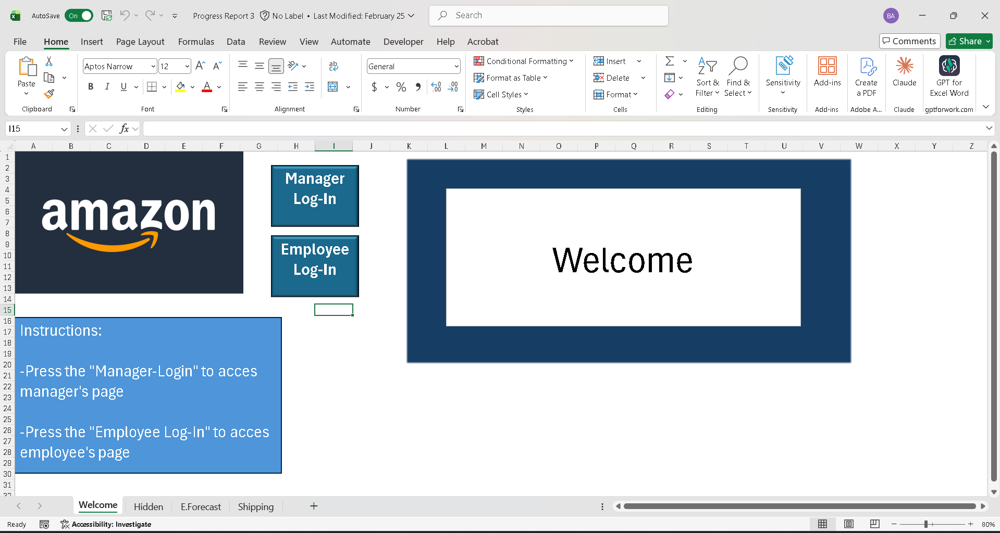
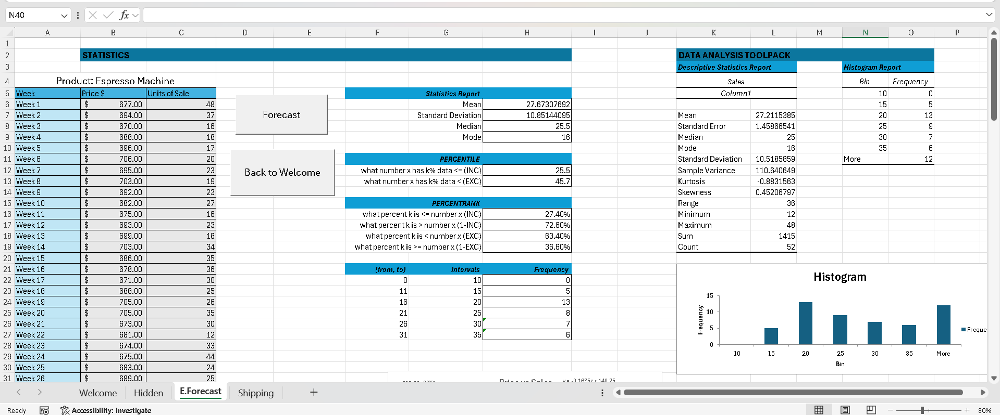
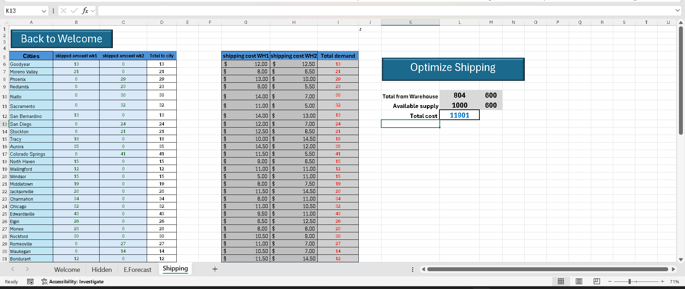

# Amazon Logistics Decision Support System

This project is an Excel-based Decision Support System built with VBA, Solver, forecasting models, and shipping optimization tools. It was created as a business analytics modeling project to support logistics-related decision-making.

## Project Overview

The workbook is designed to support Amazon-style logistics operations by helping users analyze forecasting and shipping decisions. It includes role-based navigation for Manager and Employee views, automated workbook controls, and decision models for evaluating logistics scenarios.

This project demonstrates how Excel, VBA, and Solver can be used to create a practical business tool for operations analysis and decision support.

## Project Preview

### Welcome Page

### Forecasting Model

### Shipping Optimization

## Features

- Manager and Employee workbook navigation
- VBA button controls for moving between workbook pages
- Forecasting model for logistics planning
- Solver-based shipping optimization
- Dashboard-style workbook interface
- Macro-enabled automation

## Built With

- Microsoft Excel
- VBA
- Solver Add-In
- Forecasting models
- Shipping optimization
- Decision support system design

## Skills Demonstrated

- Excel modeling
- VBA automation
- Solver optimization
- Forecasting
- Operations analysis
- Business analytics
- Dashboard-style reporting
- Decision support systems

## How to Use

1. Download the `amazon-logistics-dss.xlsm` workbook.
2. Open the file in Microsoft Excel.
3. Enable macros if prompted.
4. Use the Welcome page buttons to navigate through the workbook.
5. Review the forecasting and shipping models to see how the workbook supports logistics decision-making.

## Workbook File

The main workbook is included as:

`amazon-logistics-dss.xlsm`

Because this workbook uses VBA macros, some features may require macros to be enabled in Excel.

## Course Project

Virginia Tech  
BIT 3424 – Business Analytics Modeling  
Decision Support System Project

## Disclaimer

This project was created for educational and portfolio purposes. It is not affiliated with, endorsed by, or sponsored by Amazon.

## Author

Anthony Bible  
GitHub: [anthonyabible](https://github.com/anthonyabible)  
LinkedIn: [anthony-bible-72a9a5264](https://www.linkedin.com/in/anthony-bible-72a9a5264)
